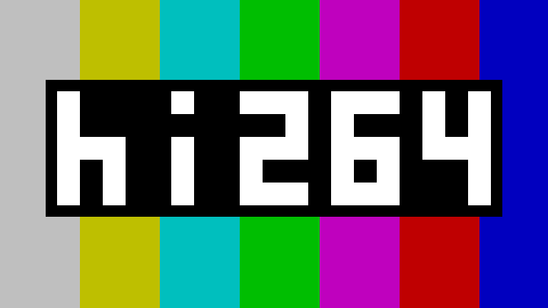

[](https://coveralls.io/github/Eyevinn/hi264?branch=main)
[](https://pkg.go.dev/github.com/Eyevinn/hi264)
[](https://goreportcard.com/report/github.com/Eyevinn/hi264)
[](https://github.com/Eyevinn/hi264/blob/main/LICENSE)
[](https://app.osaas.io/browse/eyevinn-mp4ff)

## Pure Go H.264/AVC IDR Decoder & Bitstream Generator

A focused H.264/AVC toolkit written in pure Go, designed around three things
people actually need to do with H.264 streams in production and test
pipelines without pulling in a full encoder/decoder.

### What it's for

**1. Seamlessly extend fMP4 fragments to a target duration.** Got a 1-second
CMAF segment that should be 2 seconds? `hi264-mp4-extend` appends additional
frames into the same fragment — either P\_Skip copies of the last reference
picture (a freeze) or a black IDR followed by a P\_Skip tail. The appended
slice headers reuse the source's SPS and PPS verbatim (POC type 0 or 2,
weighted\_pred=1, custom `pic_init_qp_minus26`, arbitrary
`log2_max_frame_num`), so the output decodes cleanly with no parameter-set
shuffle. This is generally **not** possible with a normal encoder run, which
would emit its own SPS/PPS and break splicing. See [Extending an existing
bitstream with empty frames](#extending-an-existing-bitstream-with-empty-frames).

**2. Make simple test content from scratch.** `hi264gen` produces valid
H.264 (CAVLC or CABAC, Annex-B or fmp4) from grid patterns, color bars,
frame counters, and timestamp overlays — no upstream encoder needed. Each
input character maps to one block of flat color; block granularity is
either 16×16 macroblocks (default) or 8×8 sub-blocks (`-8x8` flag or
`@8x8` directive — 4 characters per macroblock, finer spatial detail with
proper AC residual encoding at the quadrant boundaries). Tune the bitrate
with `-kbps` (filler-NALU padding) or `-bpp`, set frame rate, fragment
duration, GOP structure (IDR-only, IDR + P\_Skip), color space, and
range. Useful for building DASH/HLS test fixtures, exercising decoders,
and reproducing edge cases where you need to know exactly which bytes are
on the wire.

**3. Extract IDR frames as thumbnails.** `hi264dec` decodes IDR frames from
raw `.264` Annex-B or `.mp4`/`.m4v` containers and writes them as PNG, JPEG,
Y4M, or raw YUV. Pixel-perfect against FFmpeg across the supported feature
set, so a pipeline that uses hi264 for IDR thumbnails matches what FFmpeg
would have decoded. With `-n` you get N keyframes in one call.

### Why pure Go

The whole stack — decoder, encoder, CABAC/CAVLC engines, fragment
manipulation — is pure Go, with [mp4ff](https://github.com/Eyevinn/mp4ff) as
the only direct dependency for SPS/PPS/slice-header parsing and fragmented
MP4 I/O. No cgo, no FFmpeg link-time dependency, no patent-encumbered
encoder under the hood. Cross-compiles cleanly to anywhere Go runs.

### Scope and constraints

This is **not** a general-purpose video encoder — it does not accept
arbitrary pixel input or perform motion estimation. The encoder produces
I\_16x16 DC prediction frames from grid patterns (one color per 16×16 or
8×8 block), with AC residual encoding for sub-block boundaries. The
decoder handles IDR plus P\_Skip frames; full P/B-frame decoding is out
of scope. All processing is 8-bit 4:2:0 only.

Pixel-perfect match with FFmpeg IDR decoding across 41+ golden test cases
covering varied content, profiles, QP ranges, scaling matrices,
deblocking, resolutions, and both entropy coding modes.

## Build & Test

```bash
go build ./...
go test ./...
```

## CLI Tools

### hi264dec — Decode H.264 IDR frames from raw .264 or MP4

Auto-detects input format by extension (`.mp4`/`.m4v` = MP4, else Annex-B raw bitstream).
Output format detected from output extension: `.png`, `.jpg`/`.jpeg`, `.y4m`, `.yuv`.

```bash
# Raw Annex-B .264 input
go run ./cmd/hi264dec input.264 output.png             # PNG output
go run ./cmd/hi264dec input.264 output.jpg             # JPEG output
go run ./cmd/hi264dec input.264 output.y4m             # Y4M output
go run ./cmd/hi264dec input.264 output.yuv             # raw YUV (auto-adds _WxH_yuv420p suffix)

# MP4 input
go run ./cmd/hi264dec input.mp4 output.png             # decode first IDR frame
go run ./cmd/hi264dec -n 5 input.mp4 frames.png        # extract 5 IDR frames (frames_0000.png, ...)
go run ./cmd/hi264dec -n 3 input.mp4 output.y4m        # 3 frames in single Y4M file

# Options
go run ./cmd/hi264dec -no-deblock input.264 output.yuv # skip deblocking filter
go run ./cmd/hi264dec -q 95 input.264 output.jpg       # JPEG quality (default 85)
go run ./cmd/hi264dec -colorspace bt709 input.264 output.png  # override color space
go run ./cmd/hi264dec input.264                        # decode only, print info

# Decode IDR + P_Skip frames (for hi264gen-produced streams)
go run ./cmd/hi264dec -idr-and-skip -n 10 input.264 frames.png
```

### hi264gen — H.264 bitstream generator for test content

Generates valid H.264 bitstreams from grid-based patterns. Each character in a
grid maps to one block (16x16 by default, or 8x8 with `@8x8` directive) filled
with a single flat color, encoded as I_16x16 with DC prediction. This is not a
general-purpose encoder — it produces test content from color patterns, not from
arbitrary video frames.

Output format is auto-detected from the file extension, or set explicitly with `-f`:

| Extension / `-f` | Format | Notes |
|---|---|---|
| `.264` / `264` | Annex-B | Raw H.264 bitstream |
| `.mp4` / `mp4` | Fragmented MP4 | fMP4/CMAF with configurable fps and fragment duration |
| `.y4m` / `y4m` | Y4M | YUV4MPEG2 container |
| `.yuv` / `yuv` | Raw YUV | 4:2:0 planar (auto-adds `_WxH_yuv420p` suffix) |
| `.png` / `png` | PNG | Raw grid output (no H.264 encoding) |
| `.jpg` / `jpg` | JPEG | Raw grid output (`-q` for quality, default 85) |

Use `-o -` to write to stdout (requires `-f` to set the format).

For H.264 output, supports both CAVLC
(Baseline profile) and CABAC (Main profile) entropy coding. Multi-frame
sequences use P_Skip frames between IDR keyframes to copy the reference frame
unchanged (huge size reduction vs all-IDR). Image formats (YUV, Y4M, PNG, JPEG)
output the grid pattern directly without H.264 encoding, useful as reference
images for encode-decode chain verification.

```bash
# Grid-only: single IDR frame from grid pattern (frame size = grid size)
go run ./cmd/hi264gen -gi examples/sweden.gridimg -o sweden.264
go run ./cmd/hi264gen -gi examples/sweden.gridimg -cabac -o sweden_cabac.264
go run ./cmd/hi264gen -gp "xy,yx" -gc x=235,128,128 -gc y=16,128,128 -o checker.264
go run ./cmd/hi264gen -gp "ab" -gc a=255,0,0 -gc b=0,0,255 -rgb -qp 20 -o test.264

# Text overlay: frame counter on solid background
go run ./cmd/hi264gen -w 176 -h 80 -n 10 -text "%03d" -o counter.264

# Timestamp overlay
go run ./cmd/hi264gen -w 512 -h 240 -n 75 -fps 25 -text "%mm:%ss.%ff" -o timestamp.264

# With P_Skip frames (IDR every 50 frames, P_Skip copies between, CAVLC)
go run ./cmd/hi264gen -w 1280 -h 720 -n 121 -text "%03d" -idr-interval 50 -o counter.264

# With CABAC P_Skip frames (Main profile)
go run ./cmd/hi264gen -w 1280 -h 720 -n 121 -text "%03d" -cabac -idr-interval 50 -o counter.264

# Fragmented MP4 output (25 fps default, fragment every 25 frames)
go run ./cmd/hi264gen -w 176 -h 80 -n 50 -text "%03d" -o counter.mp4

# MP4 with custom framerate and fragment duration
go run ./cmd/hi264gen -w 320 -h 240 -n 75 -text "%03d" -fps 30 -frag-dur 30 -o counter.mp4

# Tiled: grid pattern tiled to fill custom dimensions, with optional text overlay
go run ./cmd/hi264gen -gi examples/checker4x4.gridimg -w 176 -h 80 -n 10 -text "%03d" -o counter.264

# SMPTE color bars with counter overlay
go run ./cmd/hi264gen -smpte -w 176 -h 80 -n 10 -text "%03d" -o smpte.264

# SMPTE bars with text background box and explicit scale
go run ./cmd/hi264gen -smpte -w 352 -h 288 -n 1 -text "%02d" -text-scale 3 -text-bg 0,0,0 -o smpte_big.264

# Multi-line text overlay (use \n to separate lines)
go run ./cmd/hi264gen -smpte -w 320 -h 240 -n 75 -fps 25 -text '%03d\n%mm:%ss.%ff' -o multiline.mp4

# Fixed bytes per picture (pad with H.264 filler NALUs for CBR-like streams)
go run ./cmd/hi264gen -smpte -w 176 -h 80 -bpp 5000 -o padded.264
go run ./cmd/hi264gen -w 320 -h 240 -n 50 -text "%03d" -bpp 8000 -o cbr_counter.mp4

# Target bitrate instead of bytes per picture (-kbps converts to bpp using -fps)
go run ./cmd/hi264gen -w 320 -h 240 -n 50 -text "%03d" -kbps 1000 -o cbr_counter.mp4

# Pipe to stdout (requires -f to specify format)
go run ./cmd/hi264gen -smpte -w 320 -h 240 -n 100 -text "%03d" -f 264 -o - | ffplay -i -
go run ./cmd/hi264gen -smpte -w 320 -h 240 -n 100 -text "%03d" -f mp4 -o - | ffplay -i -

# PNG/JPEG image as background (downsampled to block resolution)
go run ./cmd/hi264gen -gi photo.png -o photo.264                                        # native resolution
go run ./cmd/hi264gen -gi photo.png -w 320 -h 240 -o photo_scaled.264                   # scale to cover
go run ./cmd/hi264gen -gi photo.jpg -8x8 -o photo_8x8.264                               # 8x8 block detail
go run ./cmd/hi264gen -gi photo.png -w 320 -h 240 -text "%03d" -n 10 -o counter.mp4     # scale + text
go run ./cmd/hi264gen -gi photo.png -o roundtrip.png                                     # raw PNG output

# Raw image output (no H.264 encoding, useful as decoder reference)
go run ./cmd/hi264gen -gi examples/sweden.gridimg -o sweden.png
go run ./cmd/hi264gen -gi examples/sweden.gridimg -o sweden.yuv
go run ./cmd/hi264gen -gi examples/sweden.gridimg -q 95 -o sweden.jpg
go run ./cmd/hi264gen -w 176 -h 80 -n 5 -text "%03d" -o output.y4m
go run ./cmd/hi264gen -w 176 -h 80 -n 5 -text "%03d" -o frame_%03d.png
```

```bash
# Color space: generate BT.709 stream (VUI signaled in SPS)
go run ./cmd/hi264gen -gi examples/sweden.gridimg -colorspace bt709 -o sweden_709.264

# Full-range BT.709
go run ./cmd/hi264gen -smpte -w 320 -h 240 -colorspace bt709 -full-range -o smpte_709.264
```

Flags:

| Flag | Description | Default |
|---|---|---|
| `-gi` | Grid image file (`.gridimg`, `.png`, `.jpg`, `.jpeg`) | — |
| `-gp` | Inline grid pattern (e.g. `"xy,yx"`) | — |
| `-gc` | Grid color mapping (repeatable, e.g. `x=235,128,128` YCbCr or RGB with `-rgb`) | — |
| `-f` | Output format (`264`, `mp4`, `y4m`, `yuv`, `png`, `jpg`); required with `-o -` | auto-detect |
| `-rgb` | Treat `-gc` values as RGB instead of YCbCr | off |
| `-smpte` | Use built-in 75% SMPTE color bars pattern | off |
| `-w` | Frame width in pixels | grid width |
| `-h` | Frame height in pixels | grid height |
| `-n` | Number of frames | 1 |
| `-text` | Text overlay pattern (e.g. `"%03d"`, `"%mm:%ss.%ff"`, `\n` for newlines) | — |
| `-text-scale` | Text scale factor (0 = auto-fit) | 0 |
| `-text-bg` | Text background box color (R,G,B) | none |
| `-fg` | Foreground color (R,G,B) | — |
| `-bg` | Background color (R,G,B) | — |
| `-qp` | Quantization parameter | 26 |
| `-cabac` | Use CABAC entropy coding (Main profile) | off (CAVLC) |
| `-use-deblock` | Enable deblocking filter (see note below) | off |
| `-q` | JPEG quality | 85 |
| `-idr-interval` | Frames between IDR keyframes (0 = all-IDR) | 0 |
| `-bpp` | Bytes per picture (filler NAL padding) | 0 (off) |
| `-kbps` | Target bitrate in kbit/s (converted to bpp using `-fps`) | 0 (off) |
| `-colorspace` | Color space (`bt601`/`bt709`/`bt2020`) | `bt601` |
| `-full-range` | Full-range YCbCr (0-255) | off (limited) |
| `-fps` | MP4 framerate | 25 |
| `-frag-dur` | MP4 fragment duration in frames | 25 |
| `-o` | Output file (`-` for stdout) | — |

Text supports **A-Z 0-9** and punctuation **! # % + - . / : = ? [ ] _ ( )** plus space.
Lowercase input is auto-uppercased.

### Text overlays: frame counters and timestamps

The `-text` flag accepts a printf-style pattern that is re-evaluated for each
frame. Frame index and elapsed time are both derived from the current frame
number and `-fps`, so the same patterns work for `.264`, `.mp4`, `.y4m`,
`.yuv`, `.png`, and `.jpg` output.

| Specifier | Expansion | Example (frame 76 at 25 fps) |
|---|---|---|
| `%d` | Frame number, no padding | `76` |
| `%Nd` | Frame number, space-padded to N digits (e.g. `%5d`) | `   76` |
| `%0Nd` | Frame number, zero-padded to N digits (e.g. `%04d`) | `0076` |
| `%hh` | Hours, 2 digits | `00` |
| `%mm` | Minutes within hour, 2 digits | `00` |
| `%ss` | Seconds within minute, 2 digits | `03` |
| `%ff` | Frame within current second, 2 digits | `01` |
| `%ms` | Milliseconds within current second, 3 digits | `040` |
| `%%` | Literal `%` | `%` |
| `\n` | Newline (multi-line overlay) | — |

Common patterns:

```bash
# Plain frame counter
go run ./cmd/hi264gen -w 320 -h 240 -n 100 -text "%03d" -o counter.mp4

# SMPTE timecode HH:MM:SS:FF (frame-accurate)
go run ./cmd/hi264gen -smpte -w 512 -h 240 -n 250 -fps 25 -text "%hh:%mm:%ss:%ff" -o tc.mp4

# Wall-clock-style timestamp with milliseconds
go run ./cmd/hi264gen -smpte -w 640 -h 360 -n 250 -fps 25 -text "%hh:%mm:%ss.%ms" -o tc_ms.mp4

# Two-line overlay: counter on top, timestamp below
go run ./cmd/hi264gen -smpte -w 320 -h 240 -n 75 -fps 25 -text '%05d\n%mm:%ss.%ff' -o stacked.mp4

# Combine static text with a counter (lowercase auto-uppercased)
go run ./cmd/hi264gen -w 320 -h 240 -n 100 -text "frame %04d" -o labeled.mp4
```

The timestamp specifiers always reflect frame-derived time (`frame_num / fps`),
not wall-clock — so output is bit-reproducible and decoded frames carry an
unambiguous identifier for ABR/HLS/DASH test playback, segment alignment
checks, and reproducing decoder edge cases.

### Deblocking filter

The H.264 deblocking (loop) filter is disabled by default in hi264gen. Because
the encoder produces block-constrained content (one flat color per 16x16 or 8x8
block), the deblocking filter interprets intentional color transitions at block
boundaries as compression artifacts and smooths them out. This causes visible
bleeding between adjacent blocks and measurably lowers fidelity — PSNR
measurements show a 6-14 dB loss depending on QP when deblocking is enabled.
Use `-use-deblock` to re-enable it if needed.

### Constant bitrate testing with `-bpp` / `-kbps`

The `-bpp` flag pads each picture to an exact byte count using H.264 filler data
NAL units (NAL type 12, per spec section 7.3.2.7). This is useful for testing
bitrate-sensitive scenarios such as ABR ladder switching, buffer management, and
segment size constraints.

Alternatively, use `-kbps` to specify the target bitrate directly in kbit/s — it
is converted to bytes per picture using the current `-fps` value:
`bpp = kbps * 1000 / 8 / fps`. The two flags are mutually exclusive.

The target bitrate in kbit/s is: `bpp * 8 * fps / 1000`. For example, `-bpp 5000`
at 25 fps gives 1000 kbit/s (equivalent to `-kbps 1000`). An error is returned if
a frame's encoded slice already exceeds the target (use a higher QP or larger value).

A practical pattern is to use different background colors or patterns for
different bitrate tiers so the current quality level is visually obvious during
playback:

```bash
# 500 kbit/s tier — green background
go run ./cmd/hi264gen -w 320 -h 240 -n 50 -text "%03d" -bg 0,128,0 -kbps 500 -o low.mp4

# 1500 kbit/s tier — blue background
go run ./cmd/hi264gen -w 640 -h 360 -n 50 -text "%03d" -bg 0,0,200 -kbps 1500 -o mid.mp4

# 3000 kbit/s tier — red background
go run ./cmd/hi264gen -w 1280 -h 720 -n 50 -text "%03d" -bg 200,0,0 -kbps 3000 -o high.mp4
```

This makes it easy to verify that an ABR player switches between the correct
renditions — you can tell which bitrate tier is active just by looking at the
background color.

### rawpsnr — PSNR comparison for raw YUV files

Compares two raw YUV420 files and reports overall, per-component, and (with
`-per-mb`) per-16×16-macroblock PSNR. Useful for measuring encoder fidelity and
isolating which macroblocks the deblocking filter damages.

```bash
go run ./cmd/rawpsnr -w 320 -h 240 a.yuv b.yuv
go run ./cmd/rawpsnr -w 320 -h 240 -per-mb a.yuv b.yuv
go run ./cmd/rawpsnr -w 320 -h 240 -csv mb.csv a.yuv b.yuv
```

### hi264-mp4-extend — extend a fragmented MP4 segment with empty frames

Reads an init segment for SPS/PPS plus a media segment for samples and
timing, then writes a single-fragment media segment containing all the
input samples followed by N appended frames at the same per-sample
duration. By default the appended frames are P\_Skip copies of the
source's last reference picture (a freeze on the last frame). With
`-black-idr` the first appended frame is a black IDR (POC reset) and
the rest are P\_Skip copies of that IDR. The output is self-contained:

```bash
# Freeze a 1-second segment for one more second.
go run ./cmd/hi264-mp4-extend -frames 25 init.mp4 seg1s.m4s seg2s.m4s

# Splice a 1-second black tail.
go run ./cmd/hi264-mp4-extend -frames 25 -black-idr init.mp4 seg1s.m4s seg2s.m4s

# Play the result alongside the original init segment.
cat init.mp4 seg2s.m4s | ffplay -i -
```

Constraints: SPS `pic_order_cnt_type` 0 or 2 (type 1 unsupported); 8-bit
4:2:0 progressive. Works with the foreign SPS/PPS the source provides —
no reset of the parameter sets in the output.

## Image File Format

The `.gridimg` format combines color definitions and a grid layout in one file:

```
# Comments start with #
@rgb
@bt709
# Colors: char=v1,v2,v3 (YCbCr by default, RGB with @rgb directive or -rgb flag)
B=0,106,167
Y=254,204,0

BBBBBYYBBBBBBBBB
BBBBBYYBBBBBBBBB
YYYYYYYYYYYYYYYY
YYYYYYYYYYYYYYYY
BBBBBYYBBBBBBBBB
BBBBBYYBBBBBBBBB
```

Each character in the grid maps to one block. By default each character is a
16x16 macroblock; with the `@8x8` directive, each character maps to an 8x8
block (4 characters per macroblock, enabling finer spatial detail with proper
AC residual encoding). Supported directives: `@rgb` (treat values as RGB),
`@8x8` (8x8 block granularity), `@bt601`/`@bt709`/`@bt2020` (color space for
RGB-to-YCbCr conversion). See `examples/` for complete examples.

## Example Patterns

The `examples/` directory contains several `.gridimg` files:

| File | Description | Size (MBs) |
|---|---|---|
| `sweden.gridimg` | Swedish flag with official NCS colors | 16x10 |
| `france.gridimg` | French tricolore | 9x6 |
| `japan.gridimg` | Japanese flag (Hinomaru) | 12x8 |
| `rainbow_stripe.gridimg` | Vertical rainbow (6 colors) | 6x2 |
| `checker4x4.gridimg` | Red/cyan checkerboard | 4x4 |
| `gradient5.gridimg` | 5-shade gray gradient | 5x3 |
| `dark_saturated.gridimg` | Extreme chroma values | 4x4 |
| `logo.gridimg` | hi264 logo: SMPTE bars with text | 48x27 |

```bash
# Encode to H.264
go run ./cmd/hi264gen -gi examples/sweden.gridimg -o sweden.264

# Decode to PNG
go run ./cmd/hi264dec sweden.264 sweden.png

# Generate reference PNG for comparison (raw output, no H.264)
go run ./cmd/hi264gen -gi examples/sweden.gridimg -o expected.png

# Cross-verify with FFmpeg (raw YUV)
go run ./cmd/hi264dec sweden.264 sweden.yuv
ffmpeg -i sweden.264 -pix_fmt yuv420p -f rawvideo ff.yuv
cmp sweden.yuv ff.yuv  # should be identical

# Run all encoder verification tests
bash tools/verify_hi264gen.sh
```

## Library Usage

The `pkg/` packages provide a public API for use as a Go library. Implementation
details are in `internal/` and not accessible to external callers.

```go
import (
    "github.com/Eyevinn/hi264/pkg/decoder"
    "github.com/Eyevinn/hi264/pkg/encode"
    "github.com/Eyevinn/hi264/pkg/yuv"
)

// Decode an Annex-B byte stream (e.g. .264 file contents)
dec := decoder.New()
frame, err := dec.DecodeAnnexB(data)

// Decode AVC-format data (4-byte length-prefixed NALUs, e.g. from MP4 samples)
frame, err = dec.DecodeAVC(sampleData)

// Decode multi-frame stream (IDR + P_Skip)
frames, err := dec.DecodeAllAnnexB(data)

// Generate H.264 test bitstream from grid pattern
p := encode.EncodeParams{Width: 320, Height: 240, QP: 26}
sps, _ := encode.GenerateSPS(p)
pps, _ := encode.GeneratePPS(p)
idr, _ := encode.GenerateIDR(p, grid, colors, 0)

// Generate from PlaneGrid (supports 8x8 block granularity)
plane, _ := yuv.GridToPlaneGridBS(grid, colors, 8)
idr, _ = encode.GenerateIDRFromPlane(p, plane, 0)
```

> **Performance tip:** When writing encoded slices to a file, wrap the
> `io.Writer` in a `bufio.Writer` to avoid a syscall per frame. This can
> reduce write overhead by ~87% for multi-frame sequences.

### Extending an existing bitstream with empty frames

Two flows, picked by whether you want to keep decoding from the source's
last picture or restart from a new IDR.

#### One-call continuation (no new IDR)

`AppendPSkipFrames` adds N empty P\_Skip frames to an existing stream,
continuing its `frame_num` and `pic_order_cnt_lsb` progression. The
appended frames copy pixels from the source's last reference picture, so
the visible result is a freeze on the last frame.

```go
import "github.com/Eyevinn/hi264/pkg/encode"

extended, err := encode.AppendPSkipFrames(existingStream, 30) // freeze for 30 frames
```

Requires the source to have at least one SPS, PPS, and slice, and the SPS
to use `pic_order_cnt_type=0`.

#### Append a fresh IDR, then empty P\_Skip frames

To restart decoding from a new full picture (e.g. splice in a black tail
or a slate), encode an IDR with `GenerateIDR` and then add P\_Skip frames
that copy from it. The IDR resets POC to 0, so the P\_Skips use
`pic_order_cnt_lsb = 2*frame_num`:

```go
import (
    "github.com/Eyevinn/mp4ff/avc"
    "github.com/Eyevinn/hi264/pkg/encode"
    "github.com/Eyevinn/hi264/pkg/yuv"
)

// Parse SPS/PPS from the existing stream so the new IDR is compatible.
nalus := avc.ExtractNalusFromByteStream(existingStream)
spsMap := make(map[uint32]*avc.SPS)
var sps *avc.SPS
var pps *avc.PPS
for _, nalu := range nalus {
    if len(nalu) < 1 {
        continue
    }
    switch avc.GetNaluType(nalu[0]) {
    case avc.NALU_SPS:
        sps, _ = avc.ParseSPSNALUnit(nalu, true)
        spsMap[uint32(sps.ParameterID)] = sps
    case avc.NALU_PPS:
        pps, _ = avc.ParsePPSNALUnit(nalu, spsMap)
    }
}

// Encode a black IDR matching the source dimensions and entropy mode.
w, h := int(sps.Width), int(sps.Height)
blackY := uint8(16) // limited range
if sps.VUI != nil && sps.VUI.VideoFullRangeFlag {
    blackY = 0
}
grid, colors := yuv.SolidGrid(w, h, yuv.Color{Y: blackY, Cb: 128, Cr: 128})
p := encode.EncodeParams{Width: w, Height: h, QP: 26, CABAC: pps.EntropyCodingModeFlag}
idr, _ := encode.GenerateIDR(p, grid, colors, 0)

// Append IDR + 30 P_Skip copies. After the IDR, POC starts at 0.
out := append(existingStream, idr...)
for i := uint32(1); i <= 30; i++ {
    pSkip, _ := encode.EncodePSkipSlice(sps, pps, i, 2*i, 0)
    out = append(out, pSkip...)
}
```

#### Lower-level building blocks

`AppendPSkipFrames` is built on two primitives, useful when you need
finer control (custom frame_num strides, custom deblocking, splicing
multiple sources):

- `LastFrameState(stream) → (frameNum, picOrderCntLsb, err)` — read the
  last slice's identifiers from a bitstream.
- `EncodePSkipSlice(sps, pps, frameNum, picOrderCntLsb, disableDeblock)`
  — write one empty P\_Skip slice with the given header values.
  picOrderCntLsb is masked to the SPS-defined width, so wrap-around is
  handled by the decoder.

Limitations: `pic_order_cnt_type=0` only (types 1 and 2 unsupported);
PPS settings that require `pred_weight_table()` (e.g.
`weighted_pred_flag=1`) are out of scope.

## Architecture

```
pkg/decoder/       — Public: top-level decoder API (DecodeAnnexB, DecodeAVC, etc.)
pkg/encode/        — Public: bitstream generator API (flat-color I_16x16 IDR + P_Skip)
pkg/frame/         — Public: Frame type (decoded output)
pkg/yuv/           — Public: Grid, ColorMap, PlaneGrid (encode input), YUV/Y4M/PNG output
internal/cabac/    — Internal: CABAC arithmetic decoder and encoder engines
internal/cavlc/    — Internal: CAVLC bitstream reader, VLC tables, residual decoder
internal/context/  — Internal: Context model initialization (1024 contexts)
internal/slice/    — Internal: Slice data parsing, MB type decoding, residual decoding
internal/transform/— Internal: Inverse quantization and transform (4x4, 8x8, DC)
internal/pred/     — Internal: Intra prediction modes (4x4, 8x8, 16x16, chroma)
cmd/hi264dec/      — CLI: decode H.264 from raw .264 or MP4 containers
cmd/hi264gen/      — CLI: generate H.264 bitstreams or raw images from grid patterns
cmd/rawpsnr/       — CLI: per-frame / per-MB PSNR comparison for raw YUV
cmd/hi264-mp4-extend/ — CLI: extend a fragmented MP4 segment with empty frames
examples/          — Example grid image files
tools/             — Test generation and verification scripts
testdata/          — Golden H.264 bitstreams and fragmented MP4 fixtures
```

## Dependencies

- [`github.com/Eyevinn/mp4ff`](https://github.com/Eyevinn/mp4ff) — SPS/PPS/SliceHeader parsing, MP4 container, NAL extraction, fragmented MP4 creation

## Support

Join our [community on Slack](http://slack.streamingtech.se) where you can post any questions regarding any of our open source projects. Eyevinn's consulting business can also offer you:

* Further development of this component
* Customization and integration of this component into your platform
* Support and maintenance agreement

Contact [sales@eyevinn.se](mailto:sales@eyevinn.se) if you are interested.

## About Eyevinn Technology

[Eyevinn Technology](https://www.eyevinntechnology.se) is an independent consultant firm specialized in video and streaming. Independent in a way that we are not commercially tied to any platform or technology vendor. As our way to innovate and push the industry forward we develop proof-of-concepts and tools. The things we learn and the code we write we share with the industry in [blogs](https://dev.to/video) and by open sourcing the code we have written.

Want to know more about Eyevinn and how it is to work here. Contact us at work@eyevinn.se!
